```
LAB-BileAcid-Stress-Response/
│
├── README.md                                   
│
├── data/                       
│   ├── raw/                   
│   └── processed/              
├── R/                                            
│   ├── 
│   
│   └── 06_all_figures.         
│       
│
├── docs/                       
│   └── methods_.md
│
└── publication/
    └── Moreno_et_al_2024_.pdf   
```

## Contenido del repositorio

| Carpeta | Contenido |
|---------|-----------|
| `data/raw/` | Datos extraídos de figuras originales (CSV) |
| `R/` | Scripts de R para cada figura |
| `figures/` | Figuras generadas (PNG, 300 dpi) |
| `docs/` | Resumen de métodos |
| `publication/` | Paper publicado (CC BY 4.0) |

## Reproducción

### Requisitos

- R ≥ 4.0
- RStudio

### Pasos

```r
# 1. Instalar dependencias 
source("R") 

# 2. Generar todas las figuras 
source("R/06_all_figures.R")
```

## Figuras reproducidas

| Script | Figura | Descripción |
|--------|--------|-------------|
| `01_viability_conjugated.R` | Figs. 20-21 | Sobrevida con GDCA, GCA, TDCA, TCA |
| `02_viability_free.R` | Figs. 22, 24 | Sobrevida con DCA y CA |
| `03_prebiotics.R` | Fig. 25 | Efecto de inulina HP y lactulosa |
| `04_zeta_potential.R` | Figs. 40-42 | Potencial zeta con TDCA, DCA, CA |
| `05_autoaggregation.R` | Fig. 45 | Autoagregación en el tiempo |

<p align="center">
  
</p>

## Autora

**Caren Moreno**

<div align="center">

# 🧬 LAB-BileAcid-Stress-Response

### Interacción entre ácidos biliares y bacterias lácticas: su relacion con el metabolismo energetico del huesped

<p align="center">
  <a href="https://www.r-project.org/">
    
  </a>
  <a href="https://creativecommons.org/licenses/by/4.0/">
    
  </a>
  <a href="https://www.mdpi.com/2673-6284/13/3/29">
    
  </a>
  <a href="https://www.ncbi.nlm.nih.gov/nuccore/OQ107531.1">
    
  </a>
  <a href="https://www.ncbi.nlm.nih.gov/nuccore/OQ107533.1">
    
  </a>
</p>

Caren N. Moreno · Biotecnóloga · CIBAAL-UNSE-CONICET · Santiago del Estero, Argentina
Trabajo Final de Grado en Biotecnología - 2023/2024
</div>

---

## ✨ Sobre este repositorio

Este repositorio es el resultado de más de un año de trabajo experimental. Lo que encontrás acá es mi tesis de grado completa en formato abierto y reproducible: los datos, las figuras, los esquemas que construí para entender y comunicar los resultados, y el código en R que generé para re-analizar todo con herramientas bioinformáticas después de haberlo hecho originalmente en OriginPro.

Si encontrás algo útil acá, si tenés preguntas sobre los métodos, o si simplemente querés hablar de bacterias lácticas y ácidos biliares - encontrá mis datos de contacto al final.

---

## 📁 Estructura del repositorio

```
LAB-BileAcid-Stress-Response/
│
├── README.md                          ← Este archivo
├── LICENSE                            ← CC BY 4.0
│
├── figures/                           ← Todas las figuras del trabajo
│   ├── fig20_AGDC_AGC_survival.png
│   ├── fig21_ATDC_ATC_survival.png
│   ├── fig22_ADC_AC_survival.png
│   ├── fig23_conjugated_comparison.png
│   ├── fig24_free_comparison.png
│   ├── fig25_prebiotics.png
│   ├── fig26_raman_baseline.png
│   ├── fig27_raman_TDCA.png
│   ├── fig28_raman_diff_TDCA.png
│   ├── fig29_raman_DCA.png
│   ├── fig30_raman_diff_DCA.png
│   ├── fig31_raman_CA.png
│   ├── fig32_raman_diff_CA.png
│   ├── fig33_raman_fractions.png
│   ├── fig34_raman_membrane_BA.png
│   ├── fig35_raman_diff_membrane.png
│   ├── fig36_SEM_control.png
│   ├── fig37_SEM_TDCA.png
│   ├── fig38_SEM_DCA.png
│   ├── fig39_SEM_CA.png
│   ├── fig40_zeta_TDCA.png
│   ├── fig41_zeta_DCA.png
│   ├── fig42_zeta_CA.png
│   ├── fig43_cell_wall_model_biorender.png
│   ├── fig44_mechanism_biorender.png
│   └── fig45_autoaggregation.png
│
├── data/                              ← Datos recuperados de los ensayos
│   └── raw/
│       ├── fig1_GDCA_survival.csv
│       ├── fig2_GCA_survival.csv
│       ├── fig3_TDCA_survival.csv
│       ├── fig4_TCA_survival.csv
│       ├── fig5_DCA_survival.csv
│       ├── fig6_CA_survival.csv
│       ├── fig11_zetapotential_TDCA.csv
│       ├── fig12_zetapotential_DCA.csv
│       ├── fig13_zetapotential_CA.csv
│       └── fig14_autoaggregation.csv
│
└── R/                                 ← Scripts de análisis
    ├── 00_setup.R
    ├── 01_viability_conjugated.R
    ├── 02_viability_free.R
    ├── 03_prebiotics.R
    ├── 04_zeta_potential.R
    ├── 05_autoaggregation.R
    └── 06_all_figures.R
```

---

## 📋Tabla de contenidos

- [Contexto biológico](#-contexto-biológico)
- [Las bacterias del estudio](#-las-bacterias-del-estudio)
- [Capítulo I - Viabilidad y efecto de prebióticos](#-capítulo-i--viabilidad-y-efecto-de-prebióticos)
- [Capítulo II - Espectroscopía Raman](#-capítulo-ii--espectroscopía-raman)
- [Capítulo III - Morfología y propiedades de superficie](#-capítulo-iii--morfología-y-propiedades-de-superficie)
- [Estructura del repositorio](#-estructura-del-repositorio)
- [Cómo reproducir los análisis](#-cómo-reproducir-los-análisis)
- [Publicación asociada](#-publicación-asociada)
- [Cómo citar](#-cómo-citar)

---

## 🌿 Contexto biológico

Los **ácidos biliares (AB)** son los principales componentes de la bilis. Se sintetizan en el hígado a partir del colesterol y se liberan en el intestino delgado donde cumplen dos funciones fundamentales: facilitar la digestión y emulsificación de lípidos, y actuar como moduladores de la microbiota intestinal.

Para las bacterias que viven en el intestino, los AB representan una barrera química permanente. Su carácter **anfipático** les permite interactuar con las membranas bacterianas, causando:

- Alteración de la integridad de la membrana plasmática
- Daño oxidativo al ADN
- Desnaturalización de proteínas
- Disipación de la fuerza protón motriz

Para que una bacteria láctica (BL) pueda ser utilizada como **probiótico**, debe ser capaz de sobrevivir a esta barrera y colonizar, al menos transitoriamente, el tubo intestinal. Por eso, la **tolerancia a ácidos biliares** es uno de los criterios de selección más importantes en el desarrollo de cepas probióticas.

En este trabajo estudiamos la respuesta de dos BL con potencial probiótico frente a diferentes tipos de AB - conjugados (glico- y tauro-) y libres - usando una batería de técnicas complementarias: ensayos de viabilidad, espectroscopía Raman, microscopía electrónica de barrido (SEM) y medición de potencial zeta.

---

## 🦠 Las bacterias del estudio

Ambas cepas fueron aisladas de quesos artesanales de cabra y seleccionadas previamente por sus propiedades probióticas. Su identidad fue confirmada por secuenciación del gen ARN 16S.

<table>
<tr>
<th>Cepa</th>
<th>Especie</th>
<th>Código de laboratorio</th>
<th>GenBank (ARN 16S)</th>
<th>Origen</th>
</tr>
<tr>
<td><b>CB12</b></td>
<td><i>Lentilactobacillus parabuchneri</i></td>
<td>CB12</td>
<td><a href="https://www.ncbi.nlm.nih.gov/nuccore/OQ107533.1">OQ107533.1</a></td>
<td>Queso artesanal de cabra · Santiago del Estero</td>
</tr>
<tr>
<td><b>CB2</b></td>
<td><i>Lactiplantibacillus plantarum</i></td>
<td>CB2</td>
<td><a href="https://www.ncbi.nlm.nih.gov/nuccore/OQ107531.1">OQ107531.1</a></td>
<td>Queso artesanal de cabra · Santiago del Estero</td>
</tr>
</table>

> **Nota sobre nomenclatura:** A lo largo de la tesis y el paper se usan las abreviaturas CB12 y CB2. En las figuras de la publicación aparecen como *L. parabuchneri* CB12 y *Lp. plantarum* CB2 respectivamente.

---

## 📊Capítulo I - Viabilidad y efecto de prebióticos

### Los ácidos biliares evaluados

Trabajamos con seis ácidos biliares que representan las formas más relevantes fisiológicamente en el intestino delgado humano:

<div align="center">
  
| Abreviatura | Nombre completo | Tipo | Conjugado con |
|---|---|---|---|
| AGDC | Ácido glicodeoxicólico | Conjugado | Glicina |
| AGC | Ácido glicocólico | Conjugado | Glicina |
| ATDC | Ácido taurodeoxicólico | Conjugado | Taurina |
| ATC | Ácido taurocólico | Conjugado | Taurina |
| ADC | Ácido desoxicólico | **Libre** | —— |
| AC | Ácido cólico | **Libre** | —— |

</div>

Los AB libres son productos de la hidrólisis de los conjugados, catalizada por la enzima **hidrolasa de sales biliares (HSB/BSH)** - una actividad que ambas cepas presentan y que es considerada un biomarcador probiótico.

### Concentraciones inhibitorias mínimas (CIM)

Lo primero que hicimos fue determinar qué concentración de cada AB era necesaria para inhibir completamente el crecimiento de cada cepa. Estos valores nos dieron el marco de referencia para elegir las concentraciones fisiológicas subletales que usamos en todos los ensayos posteriores.

<div align="center">

| AB | CIM CB12 (mM) | CIM CB2 (mM) |
|---|---|---|
| AGC | 1,25 | 1,25 |
| ATC | 2,5 | 1,25 |
| AGDC | 0,62 | 0,62 |
| ATDC | 10 | 5 |
| AC | 0,16 | 0,16 |
| ADC | 0,31 | 0,31 |

</div>

### Resultados de viabilidad - Ácidos conjugados

<div align="center">
  <table>
    <tr>
      <td style="border: none;">
        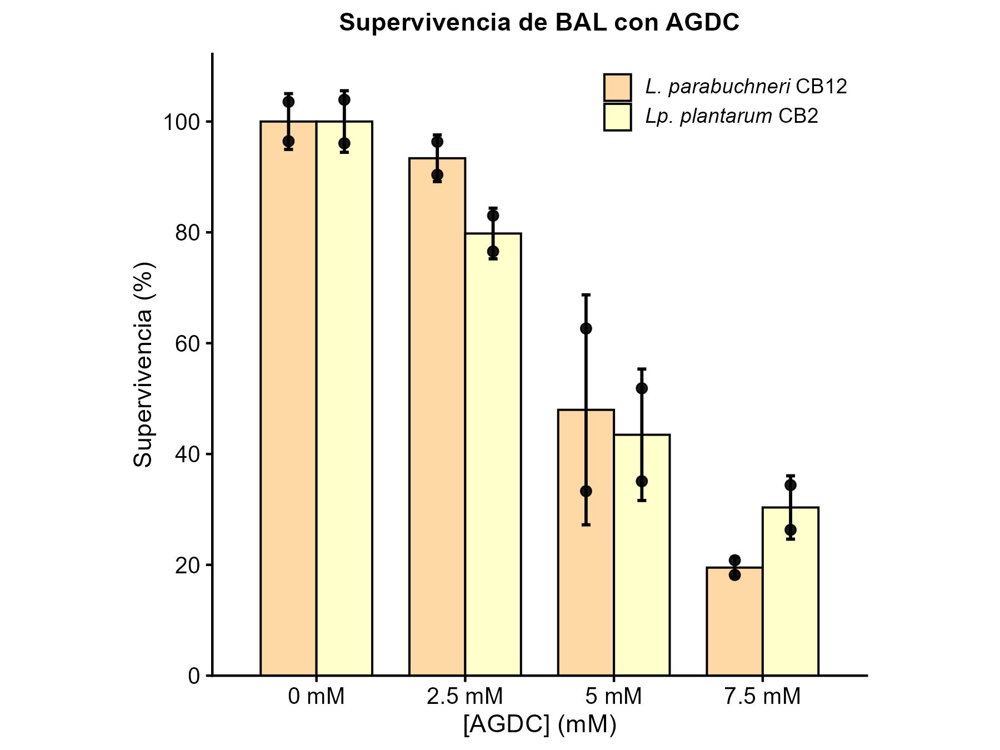
      </td>
      <td style="border: none;">
        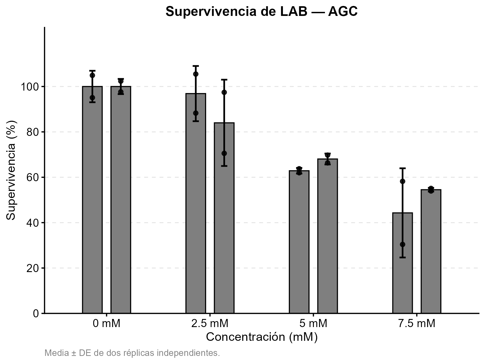
      </td>
    </tr>
  </table>
  <br>
  <sub><b>Figura 1.</b> Porcentajes de sobrevida de <i>L. parabuchneri</i> CB12 y <i>Lp. plantarum</i> CB2 en presencia de AGDC y AGC a distintas concentraciones. El AGDC resultó más inhibitorio que el AGC para ambas cepas.</sub>
</div>

<br>

<div align="center">
  <table>
    <tr>
      <td style="border: none;">
        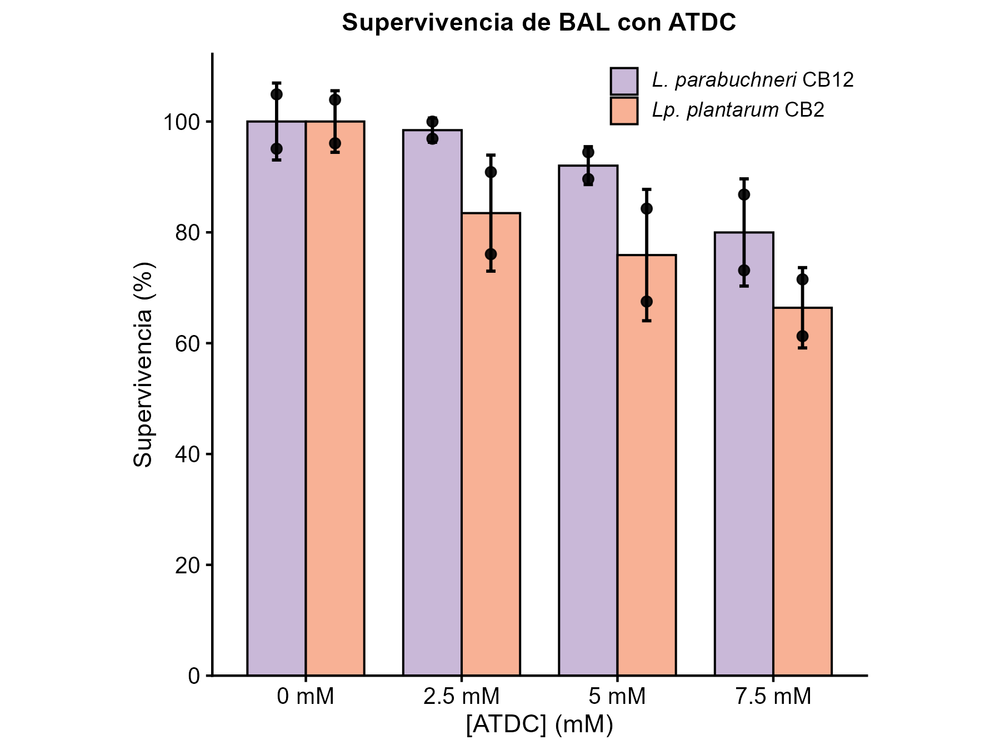
      </td>
      <td style="border: none;">
        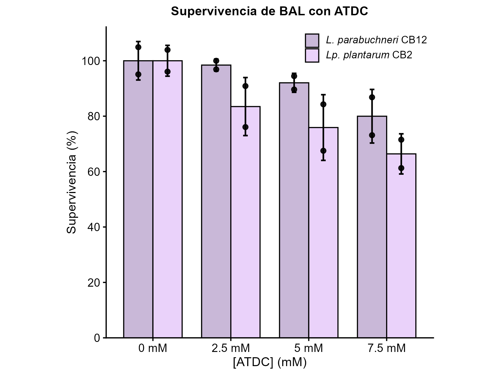
      </td>
    </tr>
  </table>
  <br>
  <sub><b>Figura 2.</b> Efecto de los ácidos biliares tauroconjugados (ATDC y ATC) sobre la viabilidad de ambas cepas. Los tauroconjugados fueron considerablemente menos inhibitorios que sus contrapartes glicoconjugadas.</sub>
</div>

<br>

<div align="center">
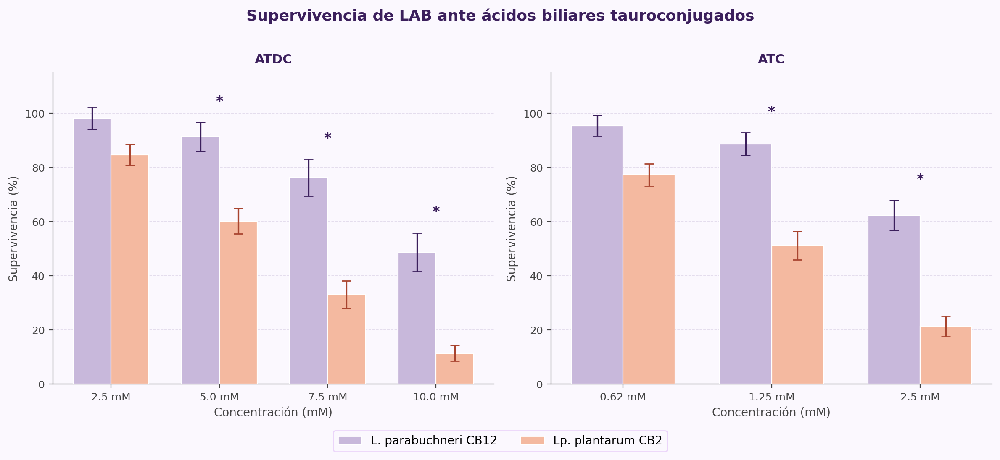
<br>
<sub><b>Figura 2.</b> Efecto de los ácidos biliares tauroconjugados (ATDC y ATC) sobre la viabilidad de ambas cepas. Los tauroconjugados fueron considerablemente menos inhibitorios que sus contrapartes glicoconjugadas.</sub>
</div>

<br>

**Lo que aprendí de estos resultados:** la toxicidad de un AB no depende solo de si está conjugado o no, sino también del aminoácido con el que está conjugado y del núcleo esteroideo. Los glicoconjugados fueron más tóxicos que los tauroconjugados, y dentro de los glico-, el AGDC (que tiene el núcleo del ácido desoxicólico, más hidrofóbico) fue el más dañino. Esto sugiere que la interacción AB-bacteria involucra tanto la conjugación como la estructura central de la molécula.

---

### Resultados de viabilidad. Ácidos libres

<div align="center">
  <table>
    <tr>
      <td style="border: none;">
        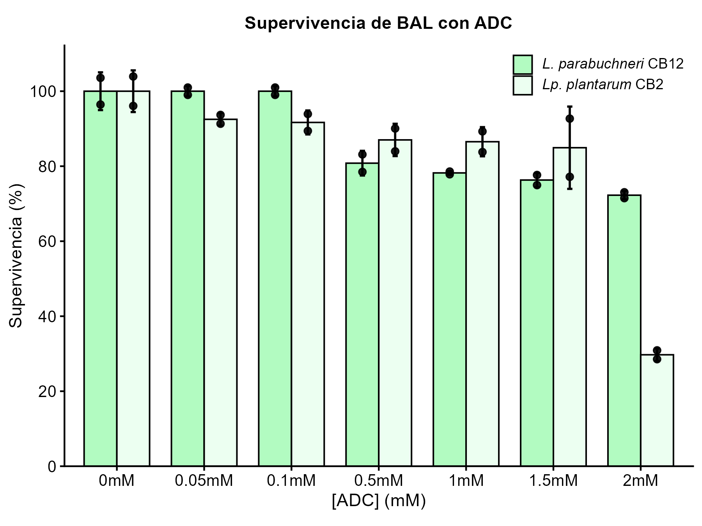
      </td>
      <td style="border: none;">
        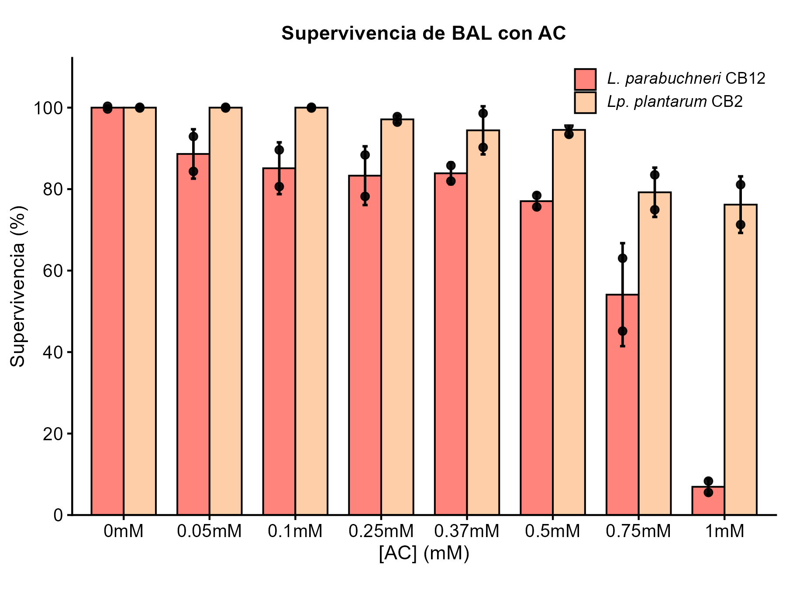
      </td>
    </tr>
  </table>
  <br>
  <sub><b>Figura 3.</b> Efecto de los ácidos biliares libres ADC (ácido desoxicólico) y AC (ácido cólico) sobre la sobrevida de ambas cepas. El AC resultó significativamente más tóxico que el ADC, mostrando inhibición completa de CB12 a 1 mM.</sub>
</div>

<br>

Este fue uno de los resultados más sorprendentes del trabajo. En la literatura, varios autores reportan que el ADC es más inhibitorio que el AC porque es más hidrofóbico y puede cruzar la membrana más rápido. Sin embargo, nuestros resultados muestran la tendencia opuesta: el AC fue el más deletéreo, especialmente para CB12, cuya viabilidad cayó por debajo del 5% a 1 mM de AC.

Un trabajo reciente de Foley et al. (2021) en *L. gasseri* y *L. acidophilus* también encontró mayor toxicidad del AC sobre el ADC, y propone que el efecto inhibitorio de los AB en BL no se limita a sus propiedades detergentes. La respuesta depende de la composición de la membrana de cada cepa y de sus mecanismos de resistencia intrínsecos.

---

### Comparación global entre todos los AB evaluados

<div align="center">
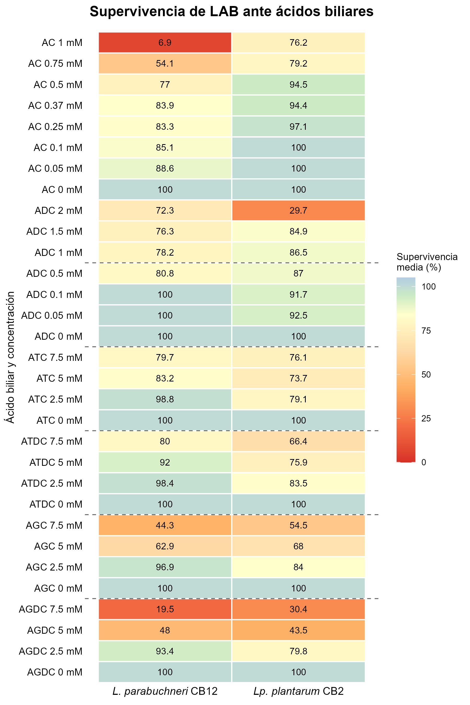
<br>
<sub><b>Figura 4.</b> Comparación de los porcentajes de sobrevida de ambas cepas con todos los AB conjugados evaluados (AGDC, AGC, ATDC, ATC) a las concentraciones 2,5; 5 y 7,5 mM.</sub>
</div>

<br>

<div align="center">
  <table>
    <tr>
      <td style="border: none;">
        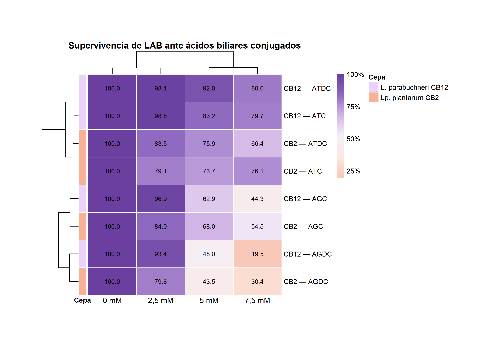
      </td>
      <td style="border: none;">
        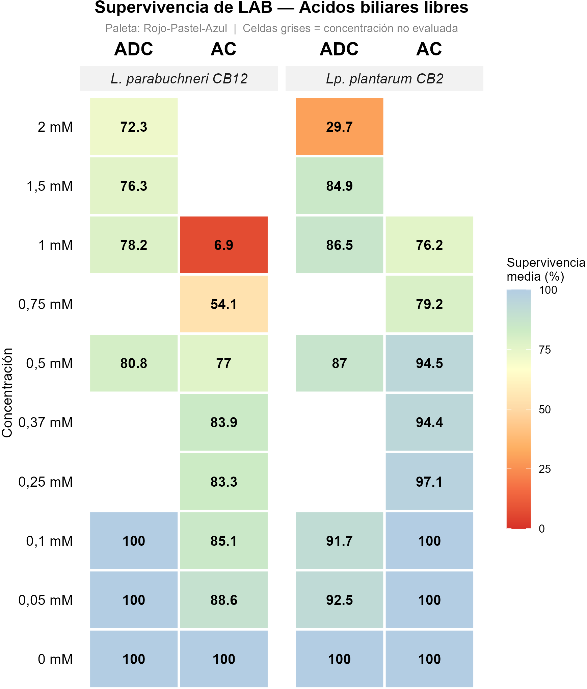
      </td>
    </tr>
  </table>
  <br>
  <sub><b>Figura 5.</b> Comparación de los porcentajes de sobrevida con los AB libres (AC y ADC). Notar la diferencia de escala en el eje X respecto a la figura anterior - los AB libres son activos a concentraciones mucho menores.</sub>
</div>

---

### Efecto de prebióticos sobre la tolerancia a AB

Una vez identificada la cepa CB12 como la más resistente y con mejores propiedades probióticas, evaluamos si la adición de **prebióticos** podía mejorar aún más su tolerancia a los AB. Los prebióticos evaluados fueron:

- **Inulina HP** - polímero de fructosa de cadena larga
- **Lactulosa** - disacárido artificial isómero de la lactosa

La hipótesis era que estos compuestos podrían actuar como fuente de energía adicional bajo condiciones de estrés, o bien reducir la solubilidad de los AB disminuyendo su toxicidad.

<div align="center">
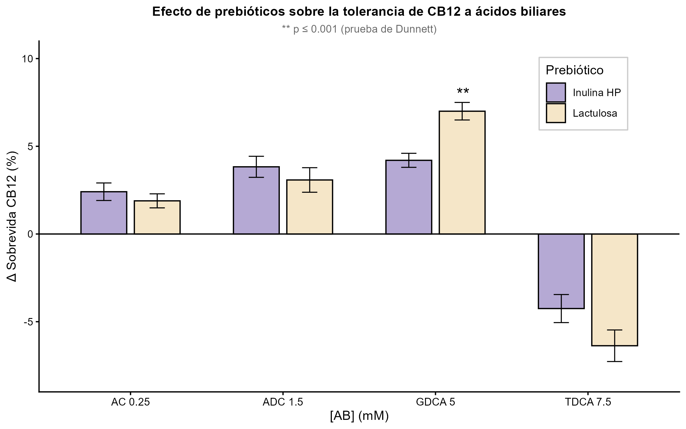
<br>
<sub><b>Figura 6.</b> Cambio en el porcentaje de sobrevida de <i>L. parabuchneri</i> CB12 con el agregado de Inulina HP o Lactulosa (2% p/v) en presencia de AC, ADC, AGDC y ATDC. Diferencias significativas se observaron solo con AGDC (** p ≤ 0,001).</sub>
</div>

<br>

El resultado más relevante: la **lactulosa aumentó un 7% la sobrevida** de CB12 en presencia de AGDC, con diferencias estadísticamente significativas (p ≤ 0,001). Este hallazgo sugiere que esta combinación podría constituir un **simbiótico complementario** con ventajas sobre el probiótico solo.

Para el ATDC, sorprendentemente, ambos prebióticos *disminuyeron* la viabilidad. Una posibilidad es que los prebióticos afecten la actividad HSB de la cepa, modificando la tasa de deconjugación del ATDC a ADC - que como vimos, es más tóxico.

---

## 🔬 Capítulo II - Espectroscopía Raman

La espectroscopía Raman es una técnica no destructiva que permite obtener una "huella molecular" de la célula bacteriana completa. Cuando los AB interactúan con las células, los cambios en la señal Raman reflejan qué macromoléculas están siendo afectadas y en qué medida.

Este capítulo fue para mí el más complejo y también el más fascinante de toda la tesis. Es, hasta donde sabemos, **la primera vez que esta técnica fue utilizada para estudiar el efecto de ácidos biliares en bacterias**.

### Espectro basal de CB12 

<div align="center">
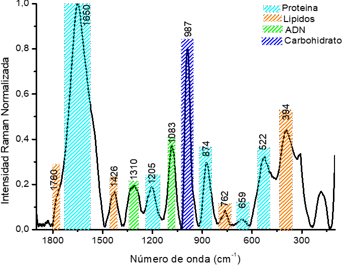
<br>
<sub><b>Figura 7.</b> Espectro Raman normalizado de <i>L. parabuchneri</i> CB12. Las regiones coloreadas corresponden a señales atribuidas a diferentes macromoléculas celulares. Imagen superior: ampliación de la región 1250-1380 cm⁻¹ mostrando las dos componentes de ADN (Adenina 1310 cm⁻¹ y Guanina 1316 cm⁻¹).</sub>
</div>

### Asignación de las principales bandas

<div align="center">

| Número de onda (cm⁻¹) | Asignación | Macromolécula |
|---|---|---|
| 1760 | Estiramiento C=O de ésteres | Lípidos |
| 1650 | Amida I (estiramiento C=O) | Proteínas |
| 1426 | Deformación C-H | Lípidos |
| 1310 / 1316 | Respiración anular (Adenina / Guanina) | ADN |
| 1205 | Amida III (estiramiento C-N) | Proteínas |
| 1083 | Estiramiento PO₂⁻, C-N, C-C | ADN / Ácidos nucleicos |
| 987 | Estiramiento C-O y C-C | Carbohidratos |
| 874 | Vibración simétrica CNC | Proteínas |
| 762 | Vibración CH₂ | Lípidos |
| 659 | Deformación N-H (βN-H) | Proteínas |
| 522 | Enlace disulfuro C-S-S-C | Proteínas |
| 394 | Vibración grupo fosfato | Lípidos / Membrana |

</div>

### Efecto del ATDC sobre las macromoléculas de CB12 

<div align="center">
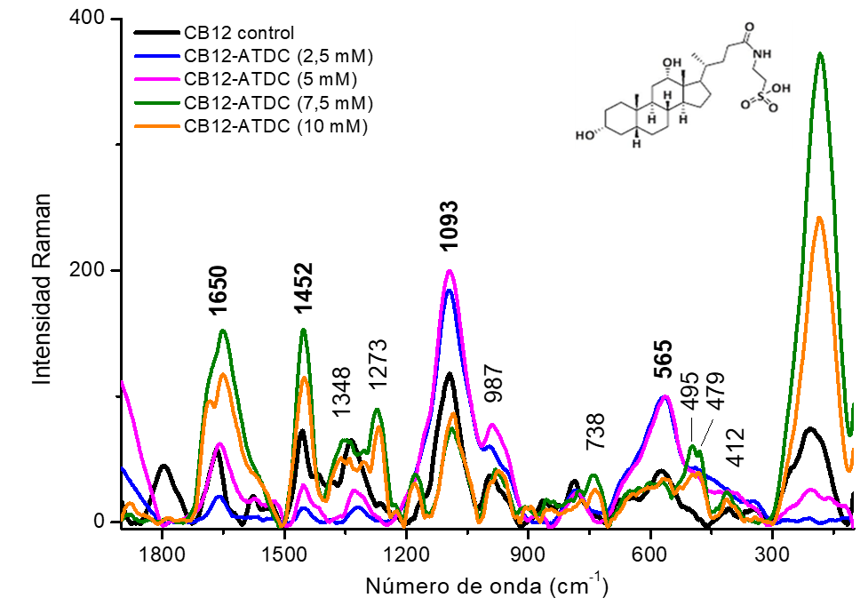
<br>
<sub><b>Figura 8.</b> Espectros Raman de <i>L. parabuchneri</i> CB12 en presencia y ausencia de ATDC (2,5; 5; 7,5 y 10 mM). A concentraciones bajas se observa incremento en las bandas de ADN, carbohidratos y puentes disulfuro. A concentraciones altas, los cambios indican ruptura y liberación de proteínas, lípidos y polisacáridos.</sub>
</div>

<br>

<div align="center">
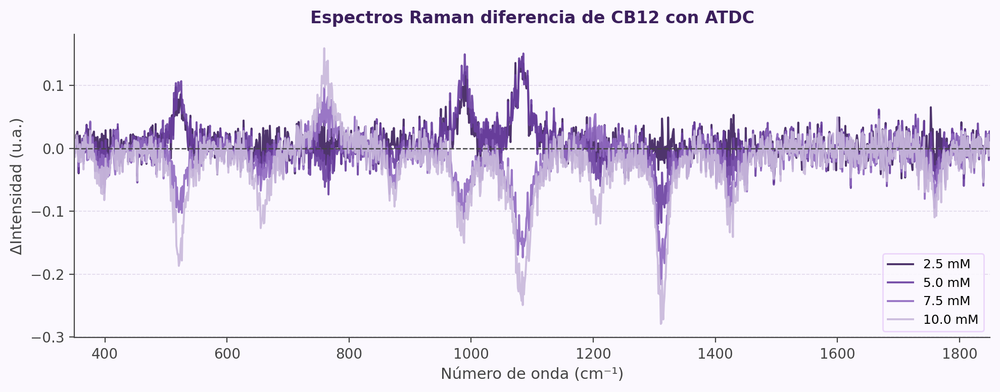
<br>
<sub><b>Figura 9.</b> Espectros Raman diferencia de CB12 incubada con ATDC a distintas concentraciones. Se restó la contribución del ATDC puro. La banda a 1687 cm⁻¹ (estructura β-lámina) indica modificación de la estructura secundaria de proteínas.</sub>
</div>

### Efecto del ADC sobre las macromoléculas de CB12

<div align="center">
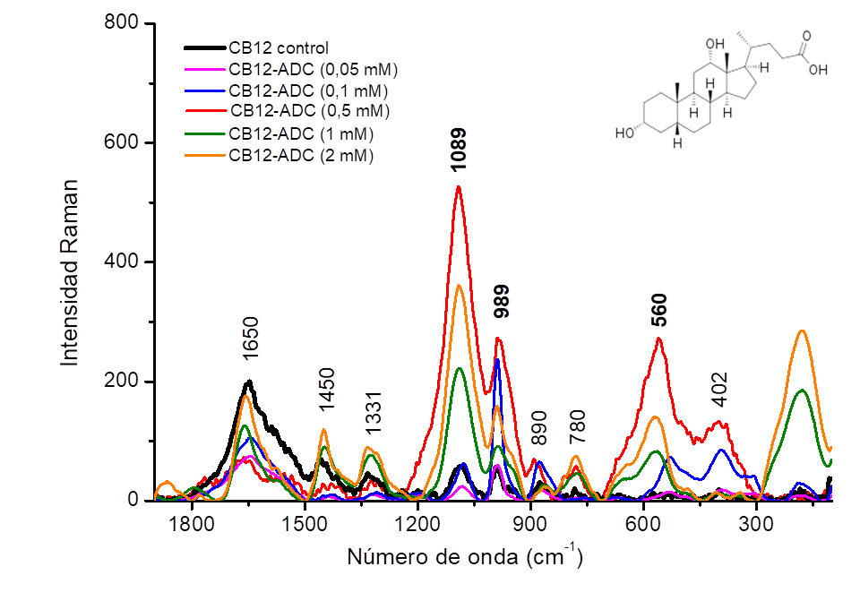
<br>
<sub><b>Figura 10.</b> Espectros Raman de CB12 en presencia de ADC (0,05 a 2 mM). A la concentración más baja (0,05 mM) no se observan cambios significativos - consistente con los ensayos de viabilidad donde esa concentración no afectó el crecimiento.</sub>
</div>

<br>

<div align="center">
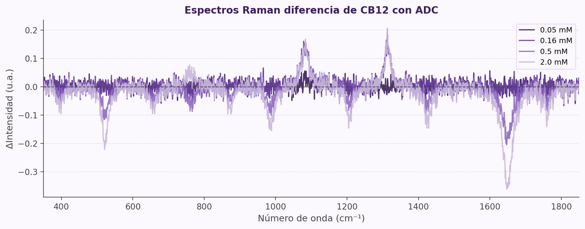
<br>
<sub><b>Figura 11.</b> Espectros Raman diferencia de CB12 con ADC. A concentraciones elevadas (0,5-2 mM) se observa incremento considerable de la señal de ADN (1089 cm⁻¹), indicando daño oxidativo en esta macromolécula.</sub>
</div>

### Efecto del AC - (el más destructivo)

<div align="center">
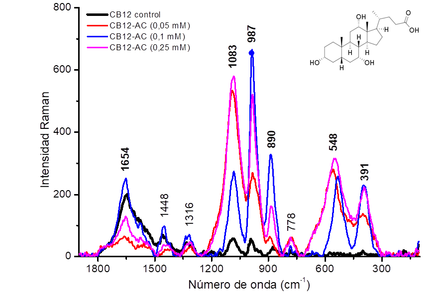
<br>
<sub><b>Figura 12.</b> Espectros Raman de CB12 con AC (0,05; 0,1 y 0,25 mM). A diferencia del ADC, el AC genera cambios importantes desde la concentración más baja evaluada - lo que explica su mayor efecto inhibitorio sobre la viabilidad celular.</sub>
</div>

<br>

<div align="center">
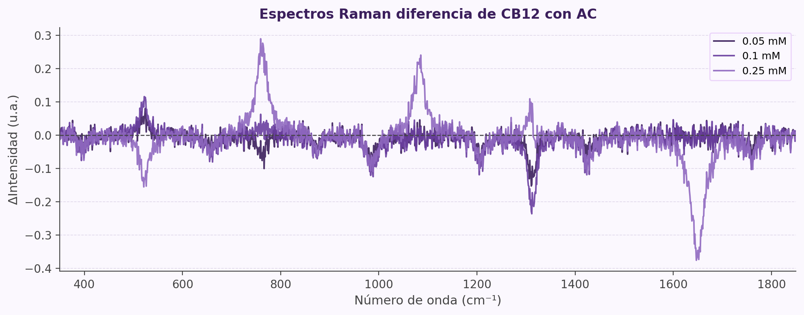
<br>
<sub><b>Figura 13.</b> Espectros Raman diferencia con AC. Se observa desplazamiento de la banda a 522 cm⁻¹ hacia 548 cm⁻¹, atribuido a la oxidación de los puentes disulfuro de proteínas.</sub>
</div>

### Análisis de fracciones celulares - membrana-pared y citoplasma

<div align="center">
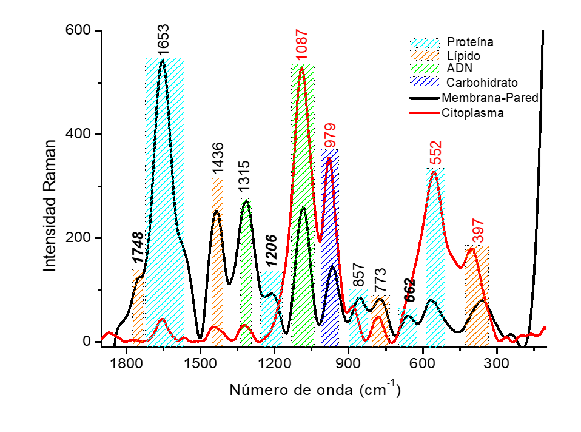
<br>
<sub><b>Figura 14.</b> Espectros Raman de las fracciones membrana-pared y citoplasma de CB12. Las bandas más intensas en membrana-pared corresponden a lípidos (1748, 1436, 773 cm⁻¹) y proteínas de capa S. En el citoplasma dominan ADN (1087 cm⁻¹) y puentes disulfuro (552 cm⁻¹).</sub>
</div>

<br>

<div align="center">
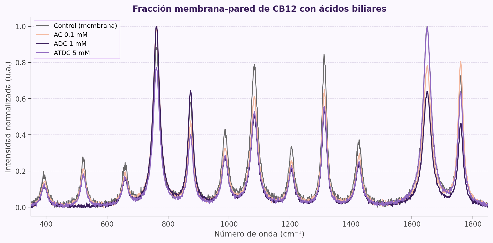
<br>
<sub><b>Figura 15.</b> Fracción membrana-pared de CB12 tratada con AC (0,1 mM), ADC (1 mM) y ATDC (5 mM). El ADC genera mayor perturbación a bajos números de onda (proteínas y fosfolípidos), mientras que el ATDC tiene mayor efecto a altos números de onda (amida I y lípidos).</sub>
</div>

<br>

<div align="center">
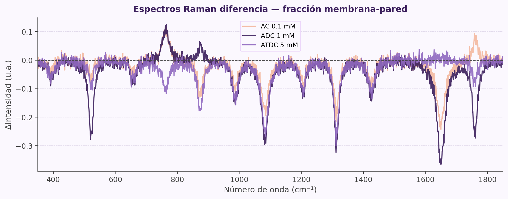
<br>
<sub><b>Figura 16.</b> Espectros Raman diferencia de la fracción membrana-pared. El AC a 0,1 mM no mostró efecto apreciable sobre esta fracción — consistente con que su mecanismo de acción principal involucra daño intracelular.</sub>
</div>

---

## 🔭 Capítulo III - Morfología y propiedades de superficie

### Microscopía electrónica de barrido (SEM)

Las imágenes de microscopía SEM permitieron visualizar directamente los cambios morfológicos que los AB producen sobre la superficie bacteriana. Fue emocionante ver estas imágenes por primera vez - la diferencia entre el control y las células tratadas es impactante.

Los análisis fueron realizados en el **Centro Integral de Microscopía Electrónica (CIME-UNT-CONICET)**.

#### CB12 sin tratar - morfología normal

<div align="center">
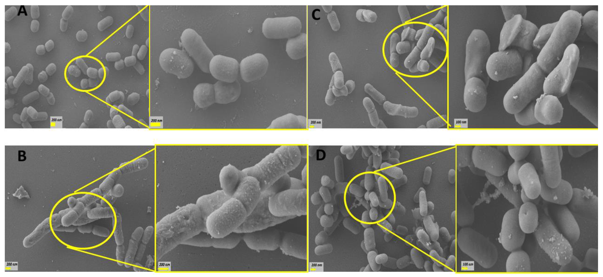
<br>
<sub><b>Figura 17.</b> Imágenes SEM de <i>L. parabuchneri</i> CB12 control a distintas magnificaciones (2500×, 5000×, 10000× y 25000×). Las células muestran morfología de bacilo corto con superficie lisa e intacta. Tamaño estimado: 577,6 ± 52,5 × 994,8 ± 218,1 nm.</sub>
</div>

#### CB12 tratada con ATDC (7,5 mM)

<div align="center">

<br>
<sub><b>Figura 18.</b> Imágenes SEM de CB12 tratada con ATDC 7,5 mM. Las células muestran superficie rugosa y porosa, depresiones superficiales (abolladuras) y tabicamiento incompleto. Se observa precipitado granuloso que podría corresponder al ADC liberado por acción de la enzima HSB.</sub>
</div>

#### CB12 tratada con ADC (2 mM)

<div align="center">

<br>
<sub><b>Figura 19.</b> Imágenes SEM de CB12 con ADC 2 mM. Se observan distorsiones de membrana severas con depresiones y pliegues superficiales. De manera notable, las bacterias forman agregados en el medio líquido - lo que se relaciona con modificaciones en sus propiedades de adhesión.</sub>
</div>

#### CB12 tratada con AC (0,5 mM)

<div align="center">

<br>
<sub><b>Figura 20.</b> Imágenes SEM de CB12 con AC 0,5 mM. Se observa una célula con perforación central (imagen c y d) - una depresión similar a un poro que podría resultar en la liberación de contenido celular esencial. También se evidencia alargamiento celular y tabicamiento irregular.</sub>
</div>

#### Cambios en el tamaño celular

<div align="center">

| Cepa | AB | Concentración (mM) | Ancho (nm) | Largo (nm) |
|---|---|---|---|---|
| CB12 | — (control) | — | 577,6 ± 52,5 | 994,8 ± 218,1 |
| CB12 | AC | 0,5 | 635,45 ± 26,51 | 1083,5 ± 464,57 |
| CB12 | ADC | 2 | 671,65 ± 37,69 | **1711,5 ± 379,72** |
| CB12 | ATDC | 7,5 | 697,95 ± 71,63 | 1558 ± 32,53 |

</div>

> El alargamiento celular, especialmente notable con ADC, es consistente con la represión de genes de división celular (incluyendo el análogo de tubulina FtsZ) reportada bajo estrés biliar.

---

### Potencial zeta (Pζ)

El potencial zeta es una medida directa de la carga superficial neta de la célula bacteriana. Su variación en presencia de AB permite inferir cómo estas moléculas interactúan con la envoltura celular - si se acumulan en la membrana (modificando la carga) o si difunden rápidamente hacia el interior.

<div align="center">
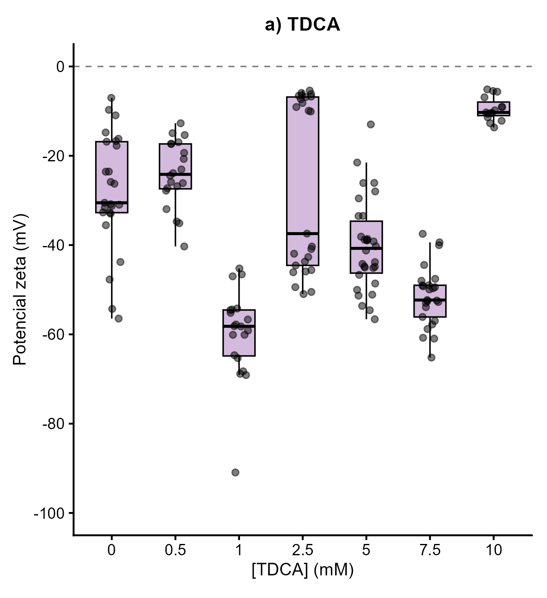
<br>
<sub><b>Figura 21.</b> Distribución de potencial zeta de CB12 en función de la concentración de ATDC. El ATDC a bajas concentraciones desplaza el Pζ hacia valores más negativos, indicando acumulación del AB en la membrana.</sub>
</div>

<br>

<div align="center">
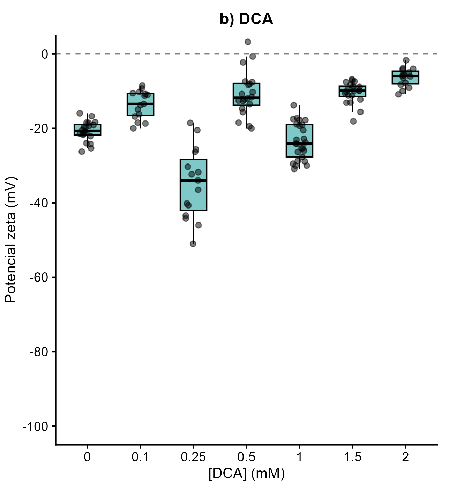
<br>
<sub><b>Figura 22.</b> Distribución de potencial zeta con ADC. A diferencia del AC y ATDC, el ADC produce cambios graduales hacia valores más positivos - consistente con difusión rápida al interior celular dada su mayor hidrofobicidad.</sub>
</div>

<br>

<div align="center">
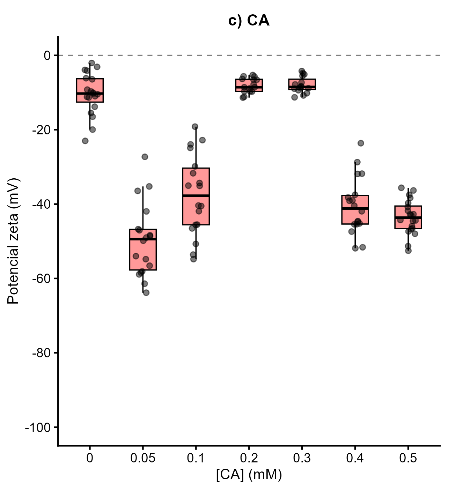
<br>
<sub><b>Figura 23.</b> Distribución de potencial zeta con AC. Comportamiento similar al ATDC: el AC a bajas concentraciones se acumula en la membrana, generando un exceso de carga negativa, antes de ingresar al citoplasma.</sub>
</div>

<br>

#### Modelo mecanístico propuesto

<div align="center">
  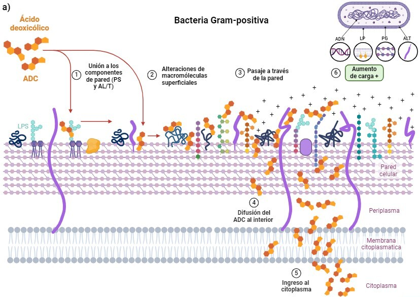
  
  <br>
  <sub><b>Figura 24.</b> Modelo propuesto para explicar la variación del potencial zeta de CB12 con los distintos AB. <b>A)</b> ADC: difunde rápidamente al interior celular aumentando la carga positiva superficial. <b>B)</b> AC y ATDC: se acumulan en los componentes de la pared (polisacáridos y ácidos lipoteicoicos), negativizando la carga superficial antes de ingresar. Creado con BioRender.com.</sub>
</div>

---

### Autoagregación 

La autoagregación es la capacidad de las bacterias de reconocerse entre sí y formar agrupaciones celulares. Es una propiedad relevante para el efecto probiótico porque las bacterias que se agregan tienen mayor capacidad de colonizar la mucosa intestinal y resistir situaciones de estrés.

<div align="center">
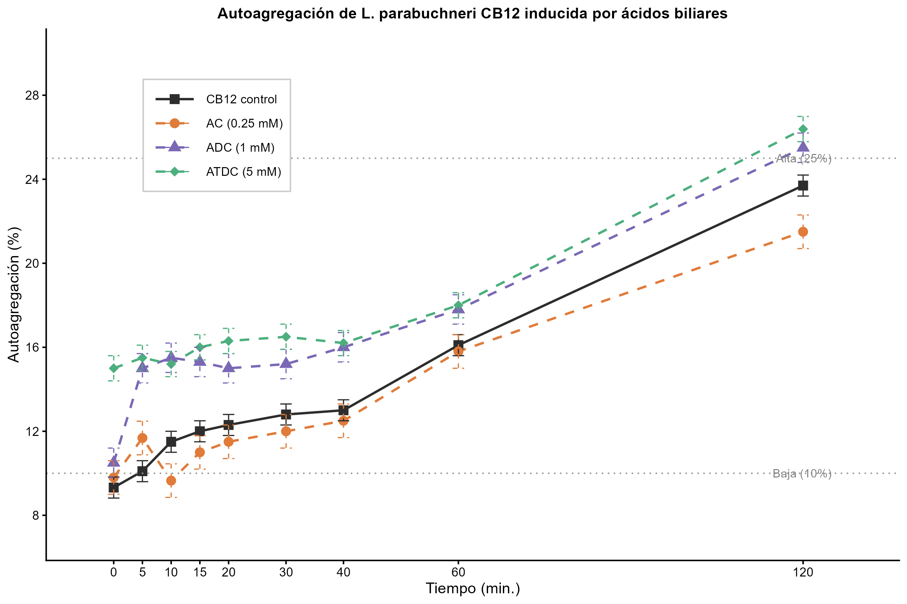
<br>
<sub><b>Figura 25.</b> Autoagregación de <i>L. parabuchneri</i> CB12 inducida por AC (0,25 mM), ADC (1 mM) y ATDC (5 mM) a distintos tiempos de incubación (0-120 min). El ADC y el ATDC aumentaron la autoagregación respecto al control, mientras que el AC no mostró efecto significativo.</sub>
</div>

<br>

#### Modelo estructural de la pared celular bacteriana

<div align="center">
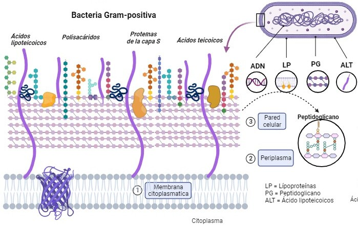
<br>
<sub><b>Figura 26.</b> Modelo estructural general de la pared celular de cepas de <i>Lactobacillus</i>. (1) Membrana citoplasmática. (2) Capa interna rica en proteínas. (3) Capa exterior rica en polisacáridos y ácidos lipoteicoicos - componentes clave en la interacción con los AB. Creado con BioRender.com.</sub>
</div>

---

## ⚙️ Cómo reproducir los análisis

### Requisitos

- R ≥ 4.0
- RStudio (recomendado)

### Instalación de dependencias

```r
install.packages(c(
  "ggplot2",
  "dplyr",
  "tidyr",
  "readr",
  "patchwork",
  "ggbeeswarm"
))
```

### Ejecución

```r
# Clonar el repositorio y abrir RStudio en esa carpeta
# Luego correr el script maestro:

source("R/06_all_figures.R")
```

> **Nota sobre los datos:** Los CSVs en `data/raw/` fueron recuperados a partir de los gráficos originales generados en OriginPro durante el trabajo experimental. Los espectros Raman no pudieron ser recuperados en formato tabular desde los archivos originales de Origin.

---

## 📄 Publicación asociada

Parte de los resultados de esta tesis fueron publicados en la revista **BioTech** (MDPI):

> **Moreno, C.N.; Gomez, J.N.; Taranto, M.P.; Ledesma, A.E.; Bustos, A.Y.**
> *Molecular Insight into the Response of Lactic Acid Bacteria to Bile Acids.*
> *BioTech* **2024**, *13*, 29.
> https://doi.org/10.3390/biotech13030029

El paper cubre los Capítulos II y III de esta tesis (espectroscopía Raman, SEM y potencial zeta). Los ensayos de viabilidad con todos los AB y el Capítulo de prebióticos forman parte del trabajo de tesis completo y no están incluidos en la publicación.

---

## 📌 Cómo citar

Si usás los datos, las figuras o el código de este repositorio en tu trabajo, podés citarlo así:

**Citar el paper (recomendado):**
```
Moreno, C.N.; Gomez, J.N.; Taranto, M.P.; Ledesma, A.E.; Bustos, A.Y.
Molecular Insight into the Response of Lactic Acid Bacteria to Bile Acids.
BioTech 2024, 13, 29. https://doi.org/10.3390/biotech13030029
```

**Citar este repositorio:**
```
Moreno, C.N. (2024). LAB-BileAcid-Stress-Response: Reproducibility repository
for "Molecular Insight into the Response of Lactic Acid Bacteria to Bile Acids".
GitHub. https://github.com/CarenMoreno/LAB-BileAcid-Stress-Response
```

---

## Autor

**Caren Moreno**

Biotecnóloga | Docente | Estudiante de Maestría en Bioinformática (UNIR)

Este trabajo fue realizado en el **Centro de Investigación en Biofísica Aplicada y Alimentos (CIBAAL-UNSE-CONICET)**, Santiago del Estero, Argentina, bajo la dirección de la Dra. Ana Y. Bustos.

---

<div align="center">

*Este repositorio es parte de mi trayectoria hacia la bioinformática.*
*Cada figura acá representa horas de trabajo en el laboratorio.*

</div>
